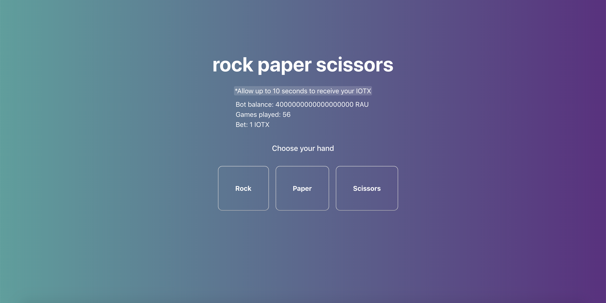

# IoTeX RPS

## About
Rock, paper, scissors bot that runs on IoTeX blockchain. 

## How to play
* Install IoTeX wallet and sign-in. 
* After signing in, bet one IOTX token and choose one of three hands. 
* Receive your funds (Tie: 1 IOTX, Win: 2 IOTX, Lose: 0 IOTX) 

## How it works
* Frontend: React
* Backend: Solidity smart contract running on IoTeX Mainnet alpha

